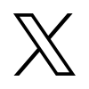

### 🛠 &nbsp;Tech Stack

<!-- JS API/Backend/Services -->

&nbsp;
&nbsp;
&nbsp;
&nbsp;
&nbsp;
&nbsp;
&nbsp;
&nbsp;
&nbsp;
&nbsp;
&nbsp;

<!-- Python API/Backend/Services -->

&nbsp;
&nbsp;
&nbsp;
&nbsp;

<!-- Cross-Language API Tools -->

&nbsp;
&nbsp;
&nbsp;

<!-- AI integration -->

&nbsp;
&nbsp;
&nbsp;

<!-- Database and ORM/ODM -->

&nbsp;
&nbsp;
&nbsp;
&nbsp;
&nbsp;
&nbsp;
&nbsp;
&nbsp;
&nbsp;

<!-- DevOps -->

&nbsp;
&nbsp;
&nbsp;
&nbsp;
&nbsp;
&nbsp;
&nbsp;
&nbsp;
&nbsp;
&nbsp;
&nbsp;
&nbsp;
&nbsp;
&nbsp;
&nbsp;

<!-- Frontend -->

&nbsp;
&nbsp;
&nbsp;
&nbsp;
&nbsp;

&nbsp;
&nbsp;
&nbsp;
&nbsp;
&nbsp;

<!-- miscellaneous -->

&nbsp;
&nbsp;
&nbsp;
&nbsp;

### ⚙️ &nbsp;GitHub Analytics

  
  

### 🤝🏻 &nbsp;Connect with Me

  
  
  

  
  
  
  

 
  

